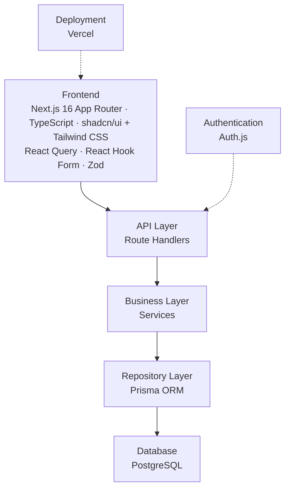

# Architecture

> How the system is layered, the technologies at each layer, and where code lives.

## System Layers

Requests flow top-to-bottom through clearly separated layers. Each layer only talks
to the one directly below it.



- **Frontend** — Next.js 16 (App Router) with shadcn/ui (Radix UI primitives)
  styled via Tailwind CSS, React Query for server-state, React Hook Form + Zod for
  forms and validation.
- **API Layer** — Next.js Route Handlers expose the HTTP surface.
- **Business Layer** — Services hold business logic, keeping route handlers thin.
- **Repository Layer** — Prisma ORM is the single point of database access.
- **Database** — PostgreSQL.
- **Authentication** — Auth.js secures the API and protected routes.
- **Deployment** — Vercel.

## Tech Stack

| Layer | Technology |
| --------------- | --------------------------- |
| Framework | Next.js 16 |
| Language | TypeScript |
| UI | shadcn/ui (Radix UI) |
| Styling | Tailwind CSS |
| Forms | React Hook Form |
| Validation | Zod |
| Data Fetching | React Query |
| Authentication | Auth.js |
| ORM | Prisma |
| Database | PostgreSQL |
| Icons | lucide-react |
| Charts | Recharts |
| State | React Context + React Query |
| Notifications | Sonner |
| Testing | Vitest + Playwright |
| Package Manager | pnpm |
| Deployment | Vercel |

## Folder Structure

```text
.
├── components.json          # shadcn/ui config
├── tailwind.config.ts       # Tailwind config
└── src/
    ├── app/
    │   ├── (auth)/
    │   │   ├── login/
    │   │   ├── register/
    │   │   └── forgot-password/
    │   ├── dashboard/
    │   ├── diary/
    │   ├── tasks/
    │   ├── profile/
    │   └── globals.css      # Tailwind directives + theme tokens
    ├── components/
    │   ├── ui/              # shadcn/ui generated components
    │   ├── common/
    │   ├── layout/
    │   ├── forms/
    │   ├── diary/
    │   └── tasks/
    ├── features/
    │   ├── auth/
    │   ├── diary/
    │   └── tasks/
    ├── hooks/
    ├── lib/                 # shared clients + utils.ts (cn helper)
    ├── services/
    ├── prisma/
    ├── types/
    ├── utils/
    ├── constants/
    └── middleware.ts
```

- `app/` — App Router routes; `(auth)` is a route group for unauthenticated pages.
  Global Tailwind styles and theme tokens live in `app/globals.css`.
- `components/ui/` — shadcn/ui components added via the CLI; other folders hold
  presentational, reusable UI grouped by domain.
- `features/` — feature modules (logic + hooks) for auth, diary, tasks.
- `services/` — business-layer services called by route handlers.
- `lib/` — shared clients plus `utils.ts` (the shadcn `cn` class-merge helper).
- `prisma/` — schema and migrations (see [Database](./DATABASE.md)).
- `middleware.ts` — route protection.

---

**Related docs:** [PRD](./PRD.md) · [Database](./DATABASE.md) · [Coding Standards](./CODING_STANDARDS.md) · [Requirements](./REQUIREMENTS.md)
