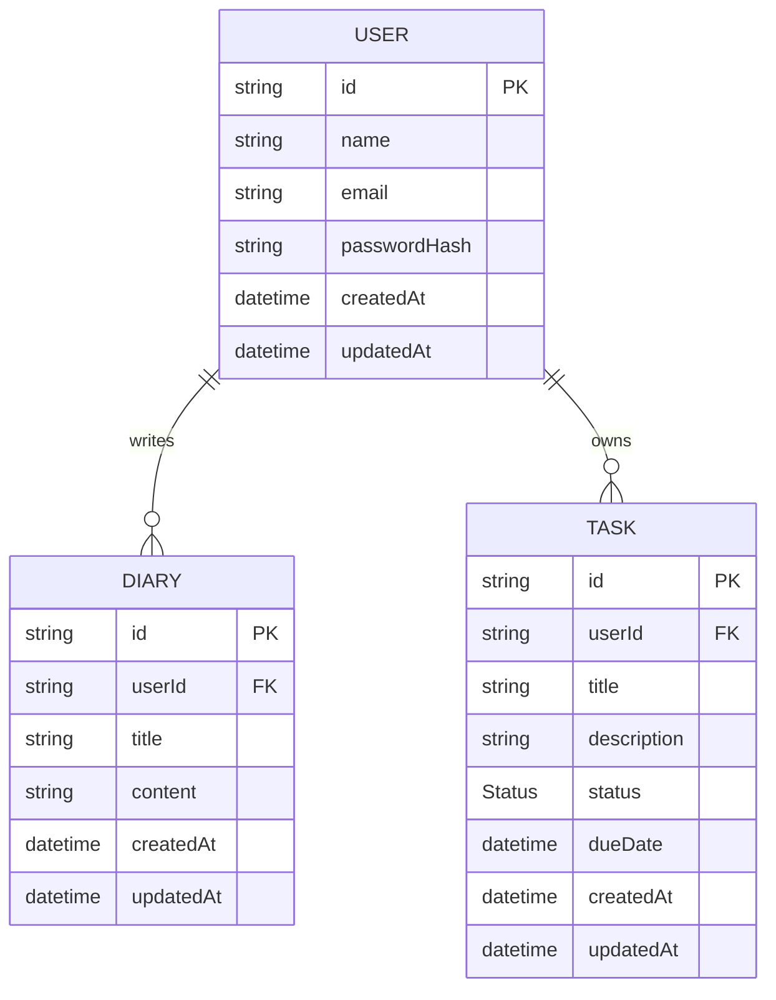

# Database

> The data model: entities, fields, and relationships. Backed by PostgreSQL via Prisma.

> **Note:** Field names come from the product spec. Types, modifiers, and relations
> below are **conventional inferences** to serve as a starting point for the Prisma
> schema — adjust as the implementation firms up.

## Models

### User

```prisma
model User {
  id           String   @id @default(cuid())
  name         String
  email        String   @unique
  passwordHash String
  createdAt    DateTime @default(now())
  updatedAt    DateTime @updatedAt

  diaries      Diary[]
  tasks        Task[]
}
```

### Diary

```prisma
model Diary {
  id        String   @id @default(cuid())
  userId    String
  title     String
  content   String
  createdAt DateTime @default(now())
  updatedAt DateTime @updatedAt

  user      User     @relation(fields: [userId], references: [id], onDelete: Cascade)

  @@index([userId])
}
```

### Task

```prisma
model Task {
  id          String    @id @default(cuid())
  userId      String
  title       String
  description String?
  status      Status    @default(Pending)
  dueDate     DateTime?
  createdAt   DateTime  @default(now())
  updatedAt   DateTime  @updatedAt

  user        User      @relation(fields: [userId], references: [id], onDelete: Cascade)

  @@index([userId])
}
```

### Status (enum)

```prisma
enum Status {
  Pending
  Completed
}
```

## Relationships

A user owns many diary entries and many tasks. Diaries and tasks each belong to
exactly one user.



---

**Related docs:** [Architecture](./ARCHITECTURE.md) · [PRD](./PRD.md) · [Requirements](./REQUIREMENTS.md)
